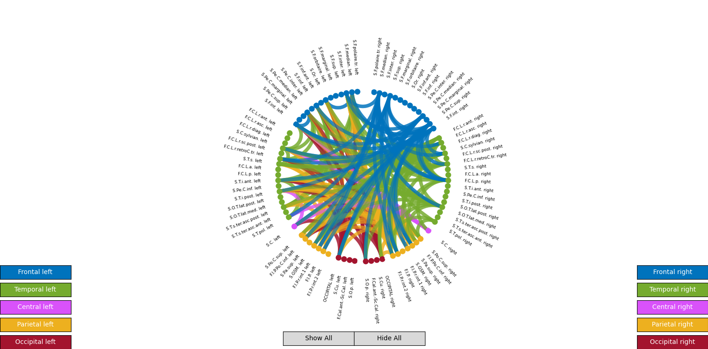

# Mekdad_Circular_Graph

This project visualizes brain connectivity as an interactive circular graph.

Connections above a certain threshold are drawn as arcs between regions arranged on a circle.
You can:
- Click nodes to toggle their connections (X / O style)
- Use control buttons to:
  - Show/Hide all edges
  - Highlight specific lobes (Frontal, Temporal, Central, Parietal, Occipital – left/right)

## Project structure

- `main.py`  
  Loads the CSV files, builds the 86×86 adjacency matrix, applies thresholding,
  reorders nodes via a permutation matrix, and calls `CircularGraph`.

- `circular_graph.py`  
  Implements the `CircularGraph` class:
  - Inserts spacer positions between lobes
  - Creates nodes around the circle
  - Draws arcs / diametric connections
  - Creates GUI buttons for lobes and Show/Hide

- `node.py`  
  A helper class representing a node on the circle:
  - Draws node marker
  - Places and rotates the label
  - Stores associated connection lines
  - Toggles visibility on click

- `utils.py`  
  Utility functions:
  - `create_permutation_matrix`
  - Filtering / validation helpers

- Data files:
  - `surface_native_net_matrix.csv` – original 123×123 connectivity matrix
  - `labelling.csv` – region indices (originally 124 entries)
  - `region_names.csv` – 86 region names
  - `color_map.csv` – RGB triplets per region

## Example visualization




## Installation

1. Create and activate a virtual environment (optional but recommended):

   ```bash
   python -m venv .venv
   # Windows:
   .venv\Scripts\activate
   # Linux/Mac:
   source .venv/bin/activate
