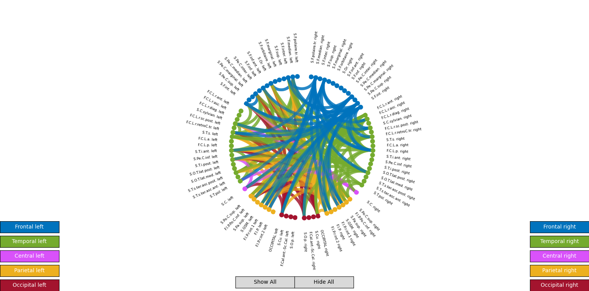

# Mekdad Circular Graph

This project visualizes brain connectivity as an interactive circular graph. Connections above a configurable threshold are drawn as arcs between regions arranged on a circle.

You can click nodes to toggle their connections, show or hide all edges, and highlight the left or right frontal, temporal, central, parietal, and occipital regions.



## Run with Python

Python 3.9 or newer is recommended.

```bash
python -m venv .venv
```

Activate the environment on Linux or macOS:

```bash
source .venv/bin/activate
```

Or on Windows PowerShell:

```powershell
.venv\Scripts\Activate.ps1
```

Install the dependencies and open the interactive graph:

```bash
pip install -r requirements.txt
python main.py
```

To render without a graphical display:

```bash
python main.py --output output/circular_graph.png
```

Use `python main.py --help` for the threshold and image-resolution options.

## Docker

### Use the prebuilt image

The latest stable image is public on GitHub Container Registry. Run these commands from a writable directory, not a protected system directory such as `C:\Windows\System32`.

On Linux or macOS:

```bash
docker pull ghcr.io/mohammad-mokdad-mm/mekdadcirculargraph:latest
mkdir -p output
docker run --rm \
  --mount type=bind,source="$(pwd)/output",target=/output \
  ghcr.io/mohammad-mokdad-mm/mekdadcirculargraph:latest
```

On Windows PowerShell:

```powershell
$outputDir = Join-Path $HOME "MekdadCircularGraph-output"
New-Item -ItemType Directory -Force -Path $outputDir
docker pull ghcr.io/mohammad-mokdad-mm/mekdadcirculargraph:latest
docker run --rm `
  --mount "type=bind,source=$outputDir,target=/output" `
  ghcr.io/mohammad-mokdad-mm/mekdadcirculargraph:latest
```

The generated file is `circular_graph.png` in the host `output` directory. Use `:edge` for the newest build from `main`, or a release version such as `:1.0.0` for a reproducible run.

### Run from Docker Desktop

Docker Desktop can run the container through its graphical interface after the image has been pulled once:

1. Open **Images** and find `ghcr.io/mohammad-mokdad-mm/mekdadcirculargraph`.
2. Select **Run**, then expand **Optional settings**.
3. Add a volume whose host path is a writable output folder and whose container path is `/output`.
4. Select **Run**. No port mapping is needed.
5. Open the host output folder and check for `circular_graph.png`.

The container renders the graph and exits, so it may appear as stopped in Docker Desktop after a successful run.

### Build locally

Build the image from the repository directory:

```bash
docker build -t mekdad-circular-graph .
```

The container renders `/output/circular_graph.png` by default. On Linux or macOS:

```bash
mkdir -p output
docker run --rm \
  --user "$(id -u):$(id -g)" \
  --mount type=bind,source="$(pwd)/output",target=/output \
  mekdad-circular-graph
```

On Windows PowerShell:

```powershell
New-Item -ItemType Directory -Force output
docker run --rm `
  --mount "type=bind,source=$($PWD.Path)\output,target=/output" `
  mekdad-circular-graph
```

Arguments after the image name override the default command. For example:

```bash
docker run --rm \
  --user "$(id -u):$(id -g)" \
  --mount type=bind,source="$(pwd)/output",target=/output \
  mekdad-circular-graph --threshold 0.9 --dpi 300 \
  --output /output/threshold-090.png
```

### Interactive Docker window on Linux

An interactive GUI needs access to the host X11 server:

```bash
xhost +local:docker
docker run --rm -it \
  --env DISPLAY \
  --env MPLBACKEND=TkAgg \
  --volume /tmp/.X11-unix:/tmp/.X11-unix:ro \
  mekdad-circular-graph --interactive
xhost -local:docker
```

Docker Desktop on Windows or macOS requires a separately configured X server. Headless image rendering is the portable option on those platforms.

## Apptainer

Apptainer runs on Linux. Each tagged GitHub Release includes a ready-to-run `mekdad-circular-graph.sif` file and a matching SHA-256 checksum. Download both from the repository's **Releases** page, then run:

```bash
sha256sum --check mekdad-circular-graph.sif.sha256
mkdir -p output
apptainer run --cleanenv \
  --bind "$PWD/output:/output" \
  mekdad-circular-graph.sif
```

To build independently from the repository definition:

```bash
apptainer build circular-graph.sif Apptainer.def
```

If the host requires an unprivileged build, use `apptainer build --fakeroot` or build through an Apptainer remote builder configured by your institution.

Render the default image:

```bash
mkdir -p output
apptainer run \
  --bind "$PWD/output:/output" \
  circular-graph.sif
```

Pass application options after the image path:

```bash
apptainer run \
  --bind "$PWD/output:/output" \
  circular-graph.sif --threshold 0.9 \
  --output /output/threshold-090.png
```

To open the interactive graph in an X11 desktop session, override the headless Matplotlib backend:

```bash
apptainer run --env MPLBACKEND=TkAgg circular-graph.sif --interactive
```

Apptainer normally forwards `DISPLAY` and binds the X11 socket automatically. If the host configuration does not, explicitly bind `/tmp/.X11-unix`.

## Project structure

- `main.py` loads and filters the bundled data and is the command-line entry point.
- `circular_graph.py` lays out nodes, connections, and interactive controls.
- `node.py` draws each node and handles click events.
- `utils.py` contains reusable loading, filtering, reordering, and validation helpers.
- `surface_native_net_matrix.csv`, `labelling.csv`, `region_names.csv`, and `color_map.csv` contain the bundled connectivity data and display metadata.
- `Dockerfile` and `Apptainer.def` provide the container builds.

## License

See [LICENSE](LICENSE).

## Publishing a release (maintainers)

The GitHub Actions workflow validates pull requests and publishes the `edge` image whenever `main` changes. To publish a stable Docker image and matching Apptainer SIF, create and push a semantic-version tag:

```bash
git tag v1.1.0
git push origin v1.1.0
```

For a `v1.1.0` tag, the workflow publishes Docker tags `1.1.0`, `1.1`, `1`, and `latest`, builds and tests the matching source revision with `Apptainer.def`, then creates the corresponding GitHub Release with the SIF and checksum attached. No registry password is required because the workflow uses GitHub's repository token.
